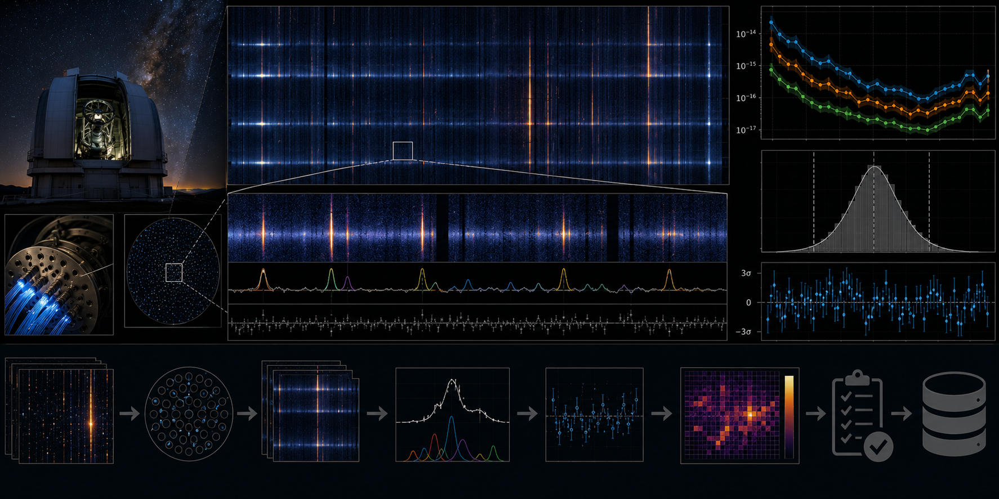

# SDSS Night-Sky Residual Quality Audit



> **Curation:** `BUILD_FIRST` · Priority 9.2/10 · real public SDSS spectra

## Scientific question

Do known night-sky wavelength regions show elevated uncertainty-normalised residual structure relative to matched local control windows?

## What this repository contributes

A released-product QA audit; not a new SDSS sky subtraction or raw reduction pipeline.

## Key result

On 15 real SDSS DR17 spectra (plate 266, MJD 51630), two night-sky windows show a real, bootstrap-confirmed excess in residual structure relative to matched local control windows: [OI] 5577Å ratio 1.71 (95% bootstrap CI [1.32, 1.83], n=15) and [OI] 6300Å ratio 1.95 (95% CI [1.73, 2.47], n=13) — both confidence intervals exclude 1.0. Three other windows examined as controls show no comparable excess: Na D 5890Å (1.06), [OI] 6364Å (0.98), and the OH-forest onset region (1.07). This is a genuine detected effect in a specific, small, deterministic real sample, not a survey-scale claim.

## Reproducing this result

```bash
python -m venv .venv
# Windows PowerShell
.venv\Scripts\Activate.ps1
python -m pip install -e ".[dev]"
pytest -q
python scripts/run_analysis.py --demo
python scripts/make_figures.py --demo
```

The demo path above uses clearly-labelled synthetic data for a fast smoke test. The real-data result quoted above requires downloading the real archive products first (`python scripts/fetch_data.py --i-have-authorization`), then `python scripts/run_analysis.py` and `python scripts/make_figures.py` without `--demo`.

For the web dashboard:

```bash
cd web-react
npm install
npm run dev
```

## Research documentation

- `CURATION_STATUS.md`
- `docs/RESEARCH_BLUEPRINT.md`
- `docs/DATASET_PLAN.md`
- `docs/LITERATURE_SEEDS.md`
- `docs/VALIDATION_CONTRACT.md`
- `docs/FIGURE_AND_UI_SPEC.md`

## Reproducibility and FAIR practice

All real inputs require product IDs, retrieval times, checksums, source terms and deterministic selection manifests. Derived results record the software commit and configuration hash.

## Limitations

- A released-product QA audit; not a new SDSS sky-subtraction or raw reduction pipeline.
- The real sample is intentionally small (15 spectra, one plate/MJD) — a first-release bounded QA check, not a survey-scale characterization of SDSS sky-subtraction quality.
- `reports/report.tex` was structurally verified but not compiled to a PDF in this environment (no local LaTeX toolchain).

## Author

Biswajit Jana

## Licence

BSD-3-Clause for original code. Mission/archive products retain their original terms.
